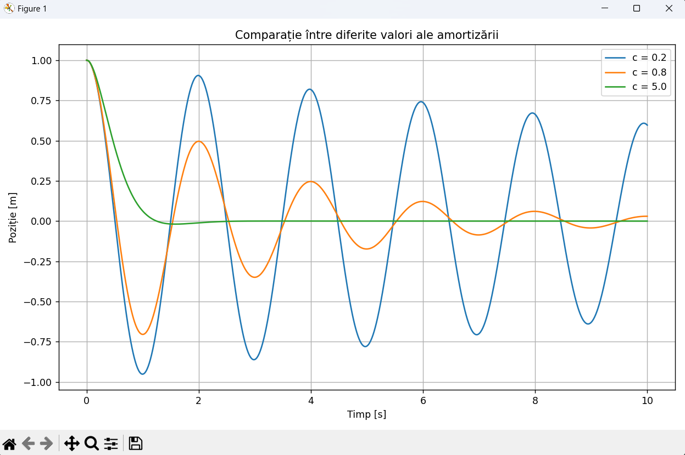
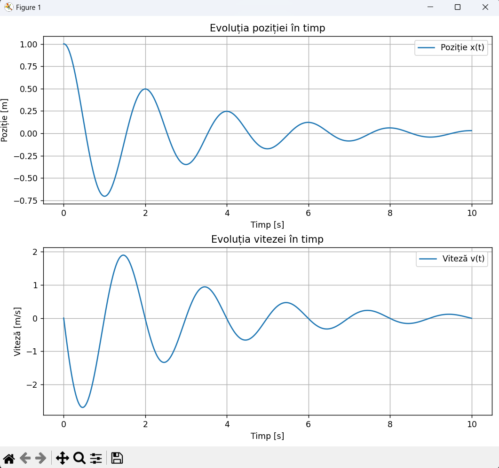

# Simularea unui Sistem Masa-Arc-Amortizor

## Descriere

Acest proiect simuleaza comportamentul dinamic al unui sistem masa-arc-amortizor (mass-spring-damper) supus unor conditii initiale, folosind integrarea numerica prin **metoda Euler**. Scopul este de a analiza cum influenteaza coeficientul de amortizare `c` raspunsul in timp al sistemului.

---

## Model Matematic

Ecuatia de miscare a unui sistem masa-arc-amortizor este:

```
m * x''(t) + c * x'(t) + k * x(t) = 0
```

unde:
- `m` - masa corpului [kg]
- `c` - coeficientul de amortizare [N*s/m]
- `k` - constanta arcului [N/m]
- `x(t)` - pozitia in functie de timp [m]
- `x'(t)` - viteza [m/s]
- `x''(t)` - acceleratia [m/s^2]

### Rescrierea ca sistem de ecuatii de ordinul 1

Pentru integrarea numerica, ecuatia de ordinul 2 se rescrie ca un sistem de doua ecuatii de ordinul 1:

```
dx/dt  =  v
dv/dt  = -(c/m) * v - (k/m) * x
```

Aceasta forma corespunde exact implementarii din `simulation.py`:
```python
dx_dt = v
dv_dt = -(c / m) * v - (k / m) * x
```

### Tipuri de amortizare

Comportamentul sistemului depinde de **factorul de amortizare** zeta (z):

```
z = c / (2 * sqrt(m * k))
```

| Conditie | Tip amortizare       | Comportament                                    |
|----------|----------------------|-------------------------------------------------|
| z < 1    | Subdampat            | Oscilatii care se sting in timp (exponential)   |
| z = 1    | Critic amortizat     | Revenire rapida la echilibru fara oscilatii     |
| z > 1    | Supradampat          | Revenire lenta la echilibru fara oscilatii      |

Amortizarea critica corespunde valorii: `c_cr = 2 * sqrt(m * k)`

---

## Parametri utilizati in simulare

Valorile de mai jos sunt exact cele definite in `main.py`:

| Parametru              | Valoare  |
|------------------------|----------|
| Masa `m`               | 1.0 kg   |
| Constanta arcului `k`  | 10.0 N/m |
| Pozitie initiala `x0`  | 1.0 m    |
| Viteza initiala `v0`   | 0.0 m/s  |
| Timp total `t_max`     | 10.0 s   |
| Pas de timp `dt`       | 0.01 s   |

**Amortizarea critica** pentru acesti parametri: `c_cr = 2 * sqrt(1.0 * 10.0) = 6.32 N*s/m`

Valorile de amortizare simulate (`damping_values = [0.2, 0.8, 5.0]` din `main.py`):

| Valoare `c` | Factor z | Tip                |
|-------------|----------|--------------------|
| 0.2         | 0.032    | Subdampat slab     |
| 0.8         | 0.126    | Subdampat moderat  |
| 5.0         | 0.790    | Subdampat puternic |

Toate trei valori sunt subdampate (z < 1) deoarece `c_cr = 6.32`, deci niciuna din valori nu o depaseste.

---

## Metoda Numerica - Metoda Euler

Metoda Euler avanseaza solutia cu un pas mic de timp `dt`:

```
x(t + dt) = x(t) + dt * v(t)
v(t + dt) = v(t) + dt * (-(c/m)*v(t) - (k/m)*x(t))
```

In `simulation.py`, numarul de pasi este calculat ca `n_steps = int(t_max / dt) + 1`, adica 1001 pasi pentru `t_max=10` si `dt=0.01`.

Este o metoda simpla de integrare explicita, potrivita pentru sisteme liniare cu pasi de timp suficient de mici.

---

## Structura Proiectului

```
TSS/
|-- main.py             # Punct de intrare; defineste parametrii si apeleaza functiile
|-- simulation.py       # Logica de simulare numerica si clasa MassSpringDamper
|-- plotting.py         # Vizualizarea rezultatelor cu matplotlib
|-- test_simulation.py  # 77 teste unitare (7 strategii de testare)
|-- README.md           # Documentatie
```

### `simulation.py`

Contine functia `simulate_mass_spring_damper(m, c, k, x0, v0, t_max, dt)` care:
- Initializeaza vectorii `t_values`, `x_values`, `v_values` cu zerouri (`np.zeros`)
- Seteaza conditiile initiale: `x_values[0] = x0`, `v_values[0] = v0`
- Itereaza prin toti pasii de timp aplicand metoda Euler
- Returneaza vectorii `t_values`, `x_values`, `v_values`

### `plotting.py`

Contine doua functii:
- `plot_single_case(t_values, x_values, v_values)` - afiseaza pozitia si viteza pe doua subgrafice (subplot 2x1) pentru cazul `c = 0.8`
- `plot_damping_comparison(m, k, x0, v0, t_max, dt, damping_values)` - suprapune evolutiile pozitiilor pentru `c = [0.2, 0.8, 5.0]` pe acelasi grafic

### `main.py`

Apeleaza simularea si vizualizarea pentru:
1. Graficul comparativ cu `damping_values = [0.2, 0.8, 5.0]`
2. Graficul detaliat (pozitie + viteza) pentru cazul `c = 0.8`

### `test_simulation.py`

Contine 77 de teste unitare organizate in 8 clase, acoperind 7 strategii de testare:
partitionare in clase de echivalenta, analiza valorilor de frontiera, acoperire la nivel
de instructiune, decizie si conditie, circuite independente (McCabe) si teste pentru mutanti.

---

## Clasa MassSpringDamper

In `simulation.py` a fost adaugata clasa `MassSpringDamper` care incapsuleaza parametrii
fizici ai sistemului si expune metode pentru determinarea tipului de amortizare si pentru
rularea simularii numerice.

### Initializare si validare

Constructorul valideaza cei trei parametri fizici si ridica `ValueError` daca valorile nu
respectă constrangerile fizice ale sistemului:

```python
from simulation import MassSpringDamper

# Sistem valid: m=1 kg, c=0.8 N*s/m, k=10 N/m
sys = MassSpringDamper(m=1.0, c=0.8, k=10.0)

# Ridica ValueError: masa trebuie sa fie strict pozitiva (m > 0)
MassSpringDamper(m=0.0, c=0.8, k=10.0)   # ValueError

# Ridica ValueError: amortizarea nu poate fi negativa (c >= 0)
MassSpringDamper(m=1.0, c=-1.0, k=10.0)  # ValueError

# Ridica ValueError: rigiditatea trebuie sa fie strict pozitiva (k > 0)
MassSpringDamper(m=1.0, c=0.8, k=0.0)    # ValueError

# c = 0 este valid (sistem neamortizat, fara frecare)
sys_conservativ = MassSpringDamper(m=1.0, c=0.0, k=10.0)  # OK
```

Implementarea validarii in `__init__`:

```python
def __init__(self, m, c, k):
    if m <= 0:
        raise ValueError("Masa m trebuie sa fie strict pozitiva")
    if c < 0:
        raise ValueError("Coeficientul de amortizare c trebuie sa fie nenegativ")
    if k <= 0:
        raise ValueError("Constanta arcului k trebuie sa fie strict pozitiva")
    self.m = m
    self.c = c
    self.k = k
```

### Determinarea tipului de amortizare

Metoda `get_damping_type()` calculeaza factorul de amortizare:

```
zeta = c / (2 * sqrt(m * k))
```

si returneaza tipul corespunzator:

```python
# zeta = 0.8 / (2 * sqrt(1.0 * 10.0)) = 0.126 -> subdampat
sys = MassSpringDamper(m=1.0, c=0.8, k=10.0)
print(sys.get_damping_type())  # "subdampat"

# zeta = 2.0 / (2 * sqrt(1.0 * 1.0)) = 1.0 -> critic
sys = MassSpringDamper(m=1.0, c=2.0, k=1.0)
print(sys.get_damping_type())  # "critic"

# zeta = 10.0 / (2 * sqrt(1.0 * 10.0)) ~ 1.58 -> supradampat
sys = MassSpringDamper(m=1.0, c=10.0, k=10.0)
print(sys.get_damping_type())  # "supradampat"
```

Implementarea in `get_damping_type()`:

```python
def get_damping_type(self):
    zeta = self.c / (2 * math.sqrt(self.m * self.k))
    if zeta < 1:
        return "subdampat"
    elif zeta == 1:
        return "critic"
    else:
        return "supradampat"
```

### Rularea simularii

Metoda `simulate(x0, v0, t_max, dt)` valideaza pasii de timp si apeleaza metoda Euler:

```python
sys = MassSpringDamper(m=1.0, c=0.8, k=10.0)

# Simulare valida: 1001 pasi (t_max/dt + 1 = 10.0/0.01 + 1)
t, x, v = sys.simulate(x0=1.0, v0=0.0, t_max=10.0, dt=0.01)
print(len(t))   # 1001
print(x[0])     # 1.0 (pozitia initiala)
print(v[0])     # 0.0 (viteza initiala)

# Ridica ValueError: dt nu poate fi egal sau mai mare ca t_max
sys.simulate(x0=1.0, v0=0.0, t_max=10.0, dt=10.0)  # ValueError

# Ridica ValueError: t_max trebuie sa fie strict pozitiv
sys.simulate(x0=1.0, v0=0.0, t_max=0.0, dt=0.01)   # ValueError
```

Implementarea validarii in `simulate()`:

```python
def simulate(self, x0, v0, t_max, dt):
    if t_max <= 0:
        raise ValueError("t_max trebuie sa fie strict pozitiv")
    if dt <= 0:
        raise ValueError("dt trebuie sa fie strict pozitiv")
    if dt >= t_max:
        raise ValueError("dt trebuie sa fie mai mic decat t_max")
    return simulate_mass_spring_damper(self.m, self.c, self.k, x0, v0, t_max, dt)
```

---

## Strategii de Testare

Testele sunt implementate in `test_simulation.py` folosind modulul `unittest` din
biblio-teca standard Python. Sunt 77 de teste organizate in 8 clase.

### 1. Partitionare in Clase de Echivalenta

Domeniul de intrare este impartit in clase de echivalenta valide (CV) si invalide (CI).
Un singur reprezentant din fiecare clasa este suficient pentru a acoperi intreaga clasa.

**Clase valide:** CV1 (m > 0), CV2 (c >= 0), CV3 (k > 0), CV4 (t_max > 0),
CV5 (0 < dt < t_max)

**Clase invalide:** CI1 (m <= 0), CI2 (c < 0), CI3 (k <= 0), CI4 (t_max <= 0),
CI5 (dt <= 0), CI6 (dt >= t_max)

```python
# CV1-CV3: parametri valizi (reprezentant al claselor valide)
sys = MassSpringDamper(m=1.0, c=0.8, k=10.0)

# CV2: c = 0 este valid (sistem neamortizat)
sys = MassSpringDamper(m=1.0, c=0.0, k=10.0)

# CI1: m = 0 (reprezentant al clasei invalide CI1)
with self.assertRaises(ValueError):
    MassSpringDamper(m=0.0, c=0.8, k=10.0)

# CI6: dt = t_max (reprezentant al clasei invalide CI6)
with self.assertRaises(ValueError):
    sys.simulate(1.0, 0.0, t_max=10.0, dt=10.0)
```

### 2. Analiza Valorilor de Frontiera (BVA)

Testele se concentreaza pe valorile exact la limita intre domeniile valid si invalid.

```python
# Frontiera m: 0 este invalid, 0.001 este valid (primul pas dincolo de frontiera)
with self.assertRaises(ValueError):
    MassSpringDamper(m=0.0, c=0.8, k=10.0)
sys = MassSpringDamper(m=0.001, c=0.8, k=10.0)  # OK

# Frontiera c: -0.001 invalid, 0.0 valid
with self.assertRaises(ValueError):
    MassSpringDamper(m=1.0, c=-0.001, k=10.0)
sys = MassSpringDamper(m=1.0, c=0.0, k=10.0)  # OK

# Frontiera zeta = 1 (amortizare critica exacta)
# m=1, k=1, c=2 -> zeta = 2/(2*sqrt(1*1)) = 1.0
sys = MassSpringDamper(m=1.0, c=2.0, k=1.0)
self.assertEqual(sys.get_damping_type(), "critic")

# Imediat sub frontiera: c=1.99 -> zeta < 1
sys = MassSpringDamper(m=1.0, c=1.99, k=1.0)
self.assertEqual(sys.get_damping_type(), "subdampat")

# Imediat peste frontiera: c=2.01 -> zeta > 1
sys = MassSpringDamper(m=1.0, c=2.01, k=1.0)
self.assertEqual(sys.get_damping_type(), "supradampat")
```

### 3. Acoperire la Nivel de Instructiune (Statement Coverage)

Fiecare linie de cod executabila este parcursa cel putin o data in setul complet de teste.
Acoperire 100% pentru metodele `__init__`, `simulate` si `get_damping_type`.

```python
# Acopera toate liniile din __init__
MassSpringDamper(m=0.0, c=0.8, k=10.0)   # linia: raise ValueError pentru m
MassSpringDamper(m=1.0, c=-1.0, k=10.0)  # linia: raise ValueError pentru c
MassSpringDamper(m=1.0, c=0.8, k=0.0)    # linia: raise ValueError pentru k
MassSpringDamper(m=1.0, c=0.8, k=10.0)   # liniile: self.m = m, self.c = c, self.k = k

# Acopera toate liniile din get_damping_type
MassSpringDamper(1.0, 0.8, 10.0).get_damping_type()   # return "subdampat"
MassSpringDamper(1.0, 2.0, 1.0).get_damping_type()    # return "critic"
MassSpringDamper(1.0, 10.0, 10.0).get_damping_type()  # return "supradampat"

# Acopera toate liniile din simulate
sys = MassSpringDamper(1.0, 0.8, 10.0)
sys.simulate(1.0, 0.0, t_max=0.0, dt=0.01)    # linia: raise ValueError t_max
sys.simulate(1.0, 0.0, t_max=10.0, dt=0.0)    # linia: raise ValueError dt
sys.simulate(1.0, 0.0, t_max=10.0, dt=10.0)   # linia: raise ValueError dt>=t_max
sys.simulate(1.0, 0.0, t_max=10.0, dt=0.01)   # linia: return simulate_mass_spring_damper
```

### 4. Acoperire la Nivel de Decizie (Decision Coverage)

Fiecare instructiune `if` este evaluata atat cu `True` cat si cu `False`.

Decizii acoperite: D1 (m <= 0), D2 (c < 0), D3 (k <= 0), D4 (t_max <= 0),
D5 (dt <= 0), D6 (dt >= t_max), D7 (zeta < 1), D8 (zeta == 1).

```python
# D1 = True: m = 0
with self.assertRaises(ValueError):
    MassSpringDamper(m=0.0, c=0.8, k=10.0)

# D1 = False + D2 = True: m valid, c negativ
with self.assertRaises(ValueError):
    MassSpringDamper(m=1.0, c=-1.0, k=10.0)

# D1 = False, D2 = False, D3 = False: toti parametri valizi
sys = MassSpringDamper(m=1.0, c=0.8, k=10.0)

# D7 = True: zeta < 1
self.assertEqual(sys.get_damping_type(), "subdampat")

# D7 = False, D8 = True: zeta == 1
sys2 = MassSpringDamper(m=1.0, c=2.0, k=1.0)
self.assertEqual(sys2.get_damping_type(), "critic")

# D7 = False, D8 = False (ramura else): zeta > 1
sys3 = MassSpringDamper(m=1.0, c=10.0, k=10.0)
self.assertEqual(sys3.get_damping_type(), "supradampat")
```

### 5. Acoperire la Nivel de Conditie (Condition Coverage)

Fiecare conditie atomica (subexpresie booleana) ia valoarea `True` si `False`
independent de celelalte conditii.

```python
# C1 (m <= 0) = True: m negativ
with self.assertRaises(ValueError):
    MassSpringDamper(m=-5.0, c=0.8, k=10.0)

# C1 (m <= 0) = False: m pozitiv
sys = MassSpringDamper(m=2.0, c=0.8, k=10.0)
self.assertGreater(sys.m, 0)

# C2 (c < 0) = True: c negativ
with self.assertRaises(ValueError):
    MassSpringDamper(m=1.0, c=-3.0, k=10.0)

# C2 (c < 0) = False: c = 0
sys = MassSpringDamper(m=1.0, c=0.0, k=10.0)
self.assertGreaterEqual(sys.c, 0)

# C6 (dt >= t_max) = True: dt egal cu t_max
with self.assertRaises(ValueError):
    sys.simulate(1.0, 0.0, t_max=5.0, dt=5.0)

# C6 (dt >= t_max) = False: dt mai mic ca t_max
t, x, v = sys.simulate(1.0, 0.0, t_max=10.0, dt=0.01)
```

### 6. Circuite Independente (Complexitate McCabe)

Complexitatea ciclomatica V(G) = E - N + 2P determina numarul de cai liniar independente.
Fiecare cale independenta este acoperita de cate un test separat.

- `__init__`: V(G) = 4 (3 cai de eroare + 1 cale de succes)
- `simulate`: V(G) = 4 (3 cai de eroare + 1 cale de succes)
- `get_damping_type`: V(G) = 3 (subdampat, critic, supradampat)

```python
# Calea 1 din __init__: m invalid -> ValueError
with self.assertRaises(ValueError):
    MassSpringDamper(m=0.0, c=0.8, k=10.0)

# Calea 2 din __init__: m valid, c invalid -> ValueError
with self.assertRaises(ValueError):
    MassSpringDamper(m=1.0, c=-2.0, k=10.0)

# Calea 3 din __init__: m, c valide, k invalid -> ValueError
with self.assertRaises(ValueError):
    MassSpringDamper(m=1.0, c=0.8, k=0.0)

# Calea 4 din __init__: toti parametri valizi -> obiect creat
sys = MassSpringDamper(m=1.0, c=0.8, k=10.0)
self.assertEqual(sys.m, 1.0)

# Calea 4 din simulate: toti parametri valizi -> simulare completa (1001 pasi)
t, x, v = sys.simulate(1.0, 0.0, 10.0, 0.01)
self.assertEqual(len(t), 1001)
```

### 7. Teste pentru Mutanti

Testele pentru mutanti detecteaza modificari subtile ale operatorilor relationali din cod.
Un mutant este "omorat" daca testul esueaza cu codul mutant dar trece cu codul original.

| Mutant | Operator original | Operator mutant | Test care omoara mutantul              |
|--------|-------------------|-----------------|----------------------------------------|
| M1     | m <= 0            | m < 0           | m=0 trebuie sa ridice ValueError       |
| M2     | c < 0             | c <= 0          | c=0 NU trebuie sa ridice ValueError    |
| M3     | k <= 0            | k < 0           | k=0 trebuie sa ridice ValueError       |
| M4     | t_max <= 0        | t_max < 0       | t_max=0 trebuie sa ridice ValueError   |
| M5     | dt <= 0           | dt < 0          | dt=0 trebuie sa ridice ValueError      |
| M6     | dt >= t_max       | dt > t_max      | dt=t_max trebuie sa ridice ValueError  |
| M7     | zeta < 1          | zeta <= 1       | zeta=1 trebuie sa returneze "critic"   |
| M8     | zeta == 1         | zeta != 1       | zeta>1 trebuie sa returneze "supradampat" |

```python
# M1: m=0 trebuie sa ridice ValueError
# (mutantul m<0 ar permite m=0 sa treaca fara eroare)
with self.assertRaises(ValueError):
    MassSpringDamper(m=0.0, c=0.8, k=10.0)

# M2: c=0 NU trebuie sa ridice ValueError
# (mutantul c<=0 ar respinge c=0 in mod gresit)
try:
    sys = MassSpringDamper(m=1.0, c=0.0, k=10.0)
    self.assertEqual(sys.c, 0.0)
except ValueError:
    self.fail("c=0 este valid, nu trebuie sa ridice ValueError")

# M7: zeta=1 trebuie sa returneze "critic", nu "subdampat"
# (mutantul zeta<=1 ar returna "subdampat" pentru zeta=1)
sys = MassSpringDamper(m=1.0, c=2.0, k=1.0)  # zeta = 1.0
result = sys.get_damping_type()
self.assertEqual(result, "critic")
self.assertNotEqual(result, "subdampat")

# M8: zeta>1 trebuie sa returneze "supradampat", nu "critic"
# (mutantul zeta!=1 ar returna "critic" pentru orice zeta diferit de 1)
sys = MassSpringDamper(m=1.0, c=10.0, k=10.0)  # zeta ~ 1.58
result = sys.get_damping_type()
self.assertEqual(result, "supradampat")
self.assertNotEqual(result, "critic")
```

---

## Instalare si rulare

### Cerinte

- Python 3.x
- `numpy`
- `matplotlib`

### Instalare dependente

```bash
pip install numpy matplotlib
```

### Rulare

```bash
python main.py
```

### Rulare Teste

```bash
python -m unittest test_simulation -v
```

Comanda ruleaza toate cele 77 de teste si afiseaza rezultatul detaliat pentru fiecare test.
Resultatul asteptat: `Ran 77 tests in X.XXXs` cu statusul `OK`.

---

## Interpretarea Rezultatelor

### Grafic comparativ - cele 3 valori de amortizare



**c = 0.2 (subdampat slab, z = 0.032)**

Sistemul oscileaza aproape fara pierdere de energie. Amplitudinea scade foarte lent, iar oscilatiile persista pe toata durata simulatiei (10 s). Frecventa oscilatiilor ramane aproape constanta. Acest comportament este specific sistemelor cu amortizare neglijabila, de exemplu un pendul in vid sau un resort cu frecare minima.

**c = 0.8 (subdampat moderat, z = 0.126)**

Amplitudinea oscilatiilor descreste vizibil mai rapid fata de cazul anterior. Sistemul continua sa oscileze, dar energia se disipeaza mai eficient. Comportamentul este specific multor sisteme mecanice reale, de exemplu sisteme de suspensie usoara. Acesta este si cazul folosit in graficul detaliat (pozitie + viteza).

**c = 5.0 (subdampat puternic, z = 0.790)**

Desi sistemul ramane tehnic subdampat (z < 1), amortizarea este suficient de puternica incat oscilatiile dispar rapid. Sistemul revine la echilibru in cateva secunde, cu oscilatii abia vizibile. Se apropie de comportamentul unui sistem critic amortizat (`c_cr = 6.32`).

### Grafic detaliat - pozitie si viteza pentru c = 0.8



Graficul este generat de `plot_single_case` si contine doua subgrafice:

- **Pozitia x(t)** (subplot de sus): prezinta oscilatii sinusoidale amortizate exponential. Fiecare ciclu are o amplitudine mai mica decat precedentul. Pozitia initiala este `x0 = 1.0 m`, iar sistemul converge catre 0.
- **Viteza v(t)** (subplot de jos): este defazata cu 90 de grade fata de pozitie. Viteza este maxima cand pozitia trece prin zero si zero cand pozitia este la extrem. Amplitudinea vitezei scade si ea exponential.

### Concluzie

Simularea demonstreaza ca valoarea coeficientului de amortizare `c` controleaza rata de disipare a energiei in sistem:
- `c` mic (0.2) -> oscilatii indelungate, energie pastrata in sistem
- `c` moderat (0.8) -> oscilatii care se sting progresiv
- `c` mare (5.0) -> revenire rapida la echilibru, comportament aproape de amortizarea critica

Metoda Euler cu `dt = 0.01 s` si `n_steps = 1001` ofera rezultate corecte calitativ pentru acest sistem liniar.
